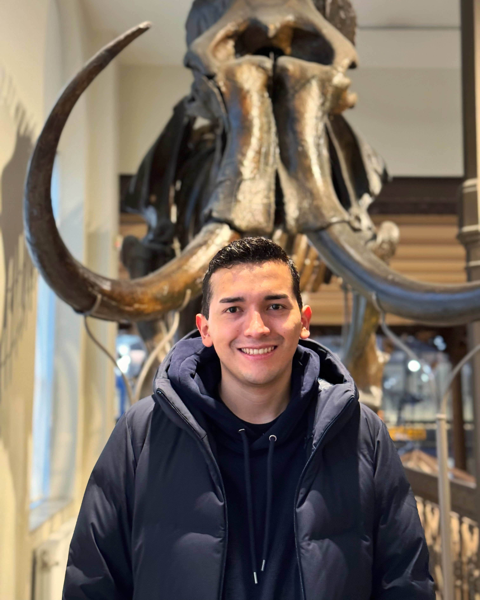

# Mauricio Valdez Ordoñez — Personal Portfolio

Personal portfolio website for Mauricio Valdez Ordoñez, Mechatronics Engineer & Robotics Researcher.  
Dark aerospace-inspired theme · Vanilla HTML + CSS + JS · GitHub Pages ready.

---

## File Structure

```
/
├── index.html                  ← Single entry point
├── README.md
└── assets/
    ├── css/
    │   └── style.css           ← All styles (design system, components, responsive)
    ├── js/
    │   └── main.js             ← Canvas animation, modals, scroll effects, project data
    ├── projects/               ← Project images (see replacement guide below)
    │   ├── uav-thesis.jpg
    │   ├── soft-robotics-heater.jpg
    │   ├── industrial-automation.jpg
    │   ├── rpa-workflows.jpg
    │   ├── plc-training.jpg
    │   └── casi-ingeniero.jpg
    ├── profile.jpg             ← Your profile photo
    └── Mauricio_Valdez_CV.pdf  ← Your CV (linked from navbar + contact section)
```

---

## GitHub Pages Deployment

### 1. Create the repository

```bash
# Option A — new repo from scratch
git init
git add .
git commit -m "Initial portfolio deployment"
gh repo create mauricio-valdez-portfolio --public --source=. --push

# Option B — push to an existing repo
git remote add origin https://github.com/YOUR_USERNAME/YOUR_REPO.git
git branch -M main
git push -u origin main
```

### 2. Enable GitHub Pages

1. Go to your repo on GitHub → **Settings** → **Pages**
2. Under **Source**, select **Deploy from a branch**
3. Choose branch: `main` · folder: `/ (root)`
4. Click **Save**
5. Your site will be live at `https://YOUR_USERNAME.github.io/YOUR_REPO/` within ~2 minutes

### 3. Custom domain (optional)

To use a domain like `mauriciovaldez.dev`:
1. Add a file named `CNAME` in the repo root containing your domain:
   ```
   mauriciovaldez.dev
   ```
2. Configure your DNS: add a `CNAME` record pointing to `YOUR_USERNAME.github.io`
3. In GitHub Pages settings, enter your custom domain and enable **Enforce HTTPS**

All asset paths are relative, so the site works correctly from any subdomain or subdirectory.

---

## Adding Your Assets

Search for `<!-- REPLACE:` comments throughout `index.html` and `main.js` to find every placeholder.

### Profile Photo
Replace the placeholder in the About section:
```html
<!-- In index.html, find: -->
<!-- REPLACE: swap the placeholder div below with: -->

```
Recommended: square or portrait crop, minimum 600×800 px.

### CV / Resume
Drop your PDF at `assets/Mauricio_Valdez_CV.pdf`. All three CV download links will work automatically.

### Project Images
Add images to `assets/projects/` using these filenames:

| File | Project |
|------|---------|
| `uav-thesis.jpg` | UAV Power Consumption Modeling |
| `uav-thesis-1.jpg`, `uav-thesis-2.jpg` | Modal gallery images |
| `soft-robotics-heater.jpg` | Flexible Heater |
| `industrial-automation.jpg` | Industrial Automation Systems |
| `rpa-workflows.jpg` | RPA Digital Workflows |
| `plc-training.jpg` | PLC Training |
| `casi-ingeniero.jpg` | YouTube Channel |

Recommended size: **1200×675 px** (16:9), JPG at ~80% quality.

### Project Videos
In `main.js`, find the `PROJECTS` array. Each project has a `videoUrl` field.  
For Casi Ingeniero (or any project), set:
```js
videoUrl: 'https://www.youtube.com/embed/VIDEO_ID',
```
Set to `null` to hide the video embed.

---

## Customisation

### Project data
All project content lives in the `PROJECTS` array at the top of `assets/js/main.js`.  
Edit `title`, `subtitle`, `shortDesc`, `fullDesc`, `tech`, and `tags` there — no HTML changes needed.

### Colors
Edit the CSS custom properties in `assets/css/style.css` under `:root`:
```css
--accent-blue:  #00a8ff;   /* Primary electric blue */
--accent-teal:  #00e5c0;   /* Secondary teal */
--bg-primary:   #0a0d12;   /* Near-black background */
```

### Adding a new section
1. Add the HTML `<section id="my-section">` in `index.html`
2. Add a nav link `<a href="#my-section">My Section</a>` in both the desktop and mobile nav
3. Add `.fade-in` class to elements you want to animate in on scroll

---

## Local Development

No build step required — open `index.html` directly in a browser, or use any static file server:

```bash
# Python (built-in)
python3 -m http.server 8000

# Node.js (npx)
npx serve .

# VS Code: use the "Live Server" extension
```

Then open `http://localhost:8000`.

---

## Performance Notes

- Google Fonts are loaded via `@import` in CSS; fonts are subsetted automatically by Google's CDN.
- The hero canvas animation uses `requestAnimationFrame` and is GPU-accelerated.
- All images use lazy loading where applicable.
- No JavaScript frameworks — total JS is < 10 KB.
